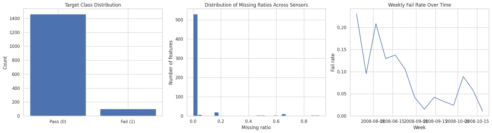
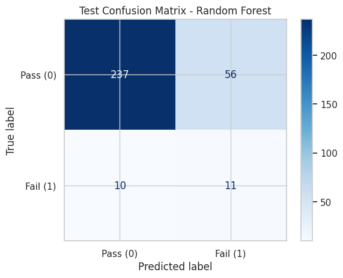
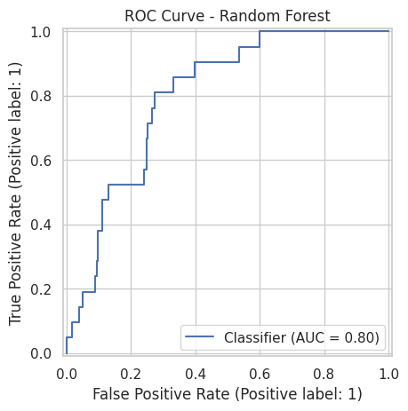
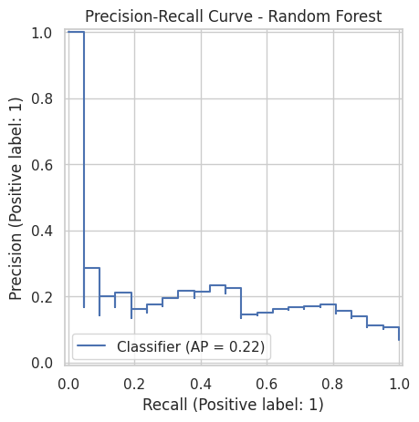
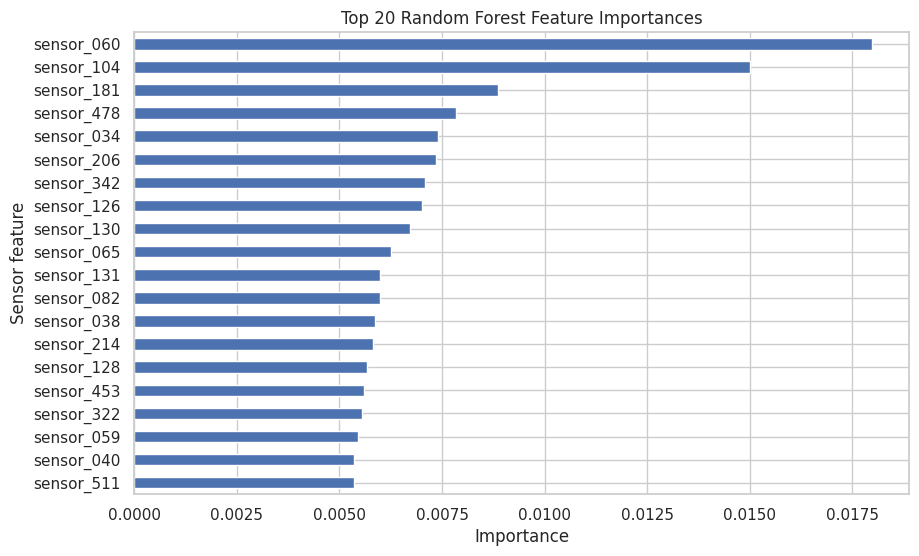
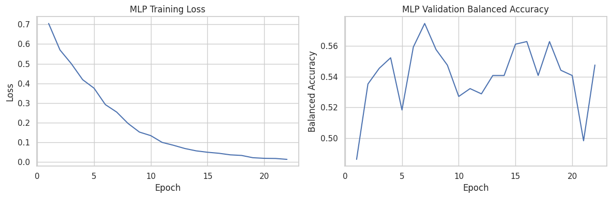

# Semiconductor Pass/Fail Prediction with the UCI SECOM Dataset

This project analyzes semiconductor pass/fail prediction using the public UCI SECOM sensor dataset. It was completed as an individual course-based project for **EAI6010: Applications of Artificial Intelligence** and later organized as a portfolio notebook.

The goal was to build a careful Python/Jupyter workflow for an imbalanced manufacturing-style classification problem. The project compares several models, tunes the final decision threshold on the validation set, and interprets the result as a screening prototype rather than a production quality-control system.

## Project Type / Status / Tools

- **Project type:** Applied machine learning / manufacturing analytics
- **Status:** Individual course project and portfolio notebook
- **Main artifact:** Jupyter Notebook
- **Dataset:** UCI SECOM semiconductor manufacturing sensor data
- **Main tools:** Python, pandas, numpy, scikit-learn, matplotlib, seaborn, PyTorch
- **Final reference model:** Random Forest selected on validation balanced accuracy
- **Production status:** Not deployed and not production-ready

## Business Problem

Semiconductor manufacturing processes generate many sensor and process measurements. A practical analytics question is whether those measurements can help flag units that are more likely to fail downstream testing.

In this project, the model is treated as a possible early screening aid. It is not presented as a final automated pass/fail decision system. A real manufacturing use case would still need engineering validation, cost-based threshold setting, time-based testing, and monitoring before deployment.

## Project Objective

The objective was to adapt an off-the-shelf AI modeling idea into a more realistic tabular machine learning workflow for the SECOM dataset.

The analysis focused on:

- auditing missing values and class imbalance
- avoiding preprocessing leakage
- comparing simple and nonlinear models
- tuning the classification threshold on validation data
- evaluating the selected model once on the holdout test set
- explaining the screening trade-off honestly

## Dataset

This repository includes the public UCI SECOM files used by the notebook.

| File | Purpose |
|---|---|
| `data/secom.data` | Sensor feature matrix used for modeling |
| `data/secom_labels.data` | Raw pass/fail labels and timestamp fields |
| `data/secom.names` | UCI metadata and dataset background |

Notebook-loaded dataset summary:

- **Rows:** 1,567
- **Loaded sensor features:** 590
- **Pass samples:** 1,463
- **Fail samples:** 104
- **Fail rate:** 6.64%
- **Timestamp range:** July 2008 to October 2008
- **Features with at least one missing value:** 538
- **Features above 50% missing in the full audit:** 28

The label is converted in the notebook as:

- `-1 -> 0` for pass
- `1 -> 1` for fail

The UCI metadata describes 591 attributes, while this project loads 590 sensor columns from `secom.data` and reads labels/timestamps from `secom_labels.data`. More detail is in [`data/README.md`](data/README.md).

## My Role / Contribution

This was an individual course-based project. I selected the SECOM dataset, rebuilt the workflow around tabular sensor data, ran the analysis, compared the models, interpreted the results, and prepared the notebook/report materials.

## Methodology

The final workflow was:

1. Load SECOM sensor data, labels, and metadata.
2. Convert raw labels into a binary pass/fail target.
3. Parse timestamps for exploratory analysis.
4. Audit class balance, missing values, low-information features, and time patterns.
5. Create a stratified train/validation/test split.
6. Fit preprocessing steps on the training data only.
7. Drop high-missing columns using the training split only.
8. Apply median imputation.
9. Remove constant features for the linear/neural-network path.
10. Apply scaling and PCA for Logistic Regression and MLP paths.
11. Use an imputation-only feature path for the Random Forest.
12. Compare Dummy Classifier, Logistic Regression + PCA, Random Forest, and a class-weighted PyTorch MLP.
13. Tune thresholds on validation balanced accuracy.
14. Evaluate the selected model once on the holdout test set.

## Key Findings

- The dataset is highly imbalanced, with only 104 fail cases out of 1,567 rows.
- Missing values are spread across many sensor columns, so missingness handling is an important part of the workflow.
- Random Forest had the strongest validation balanced accuracy among the compared models.
- Logistic Regression + PCA remained useful as a simpler baseline.
- The class-weighted MLP achieved high validation recall but with very low precision and much lower overall accuracy.
- The final Random Forest threshold was **0.110**, which shows why threshold tuning matters for this imbalanced problem.
- On the holdout test set, the Random Forest detected **11 of 21 fail cases**, but it also produced many false positives.
- The result suggests a possible screening signal, not a production-ready quality decision system.

## Model Evaluation Note

The Random Forest was selected based on validation balanced accuracy. This should be treated as a split-specific result, not proof that Random Forest would always be the best model on future data.

Final holdout test metrics for the selected Random Forest:

| Metric | Value |
|---|---:|
| Threshold | 0.110 |
| Accuracy | 0.7898 |
| Balanced accuracy | 0.6663 |
| Specificity | 0.8089 |
| Precision | 0.1642 |
| Recall | 0.5238 |
| F1 | 0.2500 |
| ROC-AUC | 0.7978 |
| PR-AUC | 0.2192 |

Final test confusion matrix:

|  | Predicted pass | Predicted fail |
|---|---:|---:|
| True pass | 237 | 56 |
| True fail | 10 | 11 |

The confusion matrix is the most useful way to read the result. The model caught some fail cases, but the number of false positives means it would need business and engineering review before any real operating use.

## Visual Highlights

### EDA overview

This figure shows the target imbalance, missing-value pattern, and weekly fail-rate trend.



### Random Forest confusion matrix

This figure shows the main screening trade-off on the holdout test set.



### ROC and precision-recall curves

The ROC curve and PR curve should be read together because the fail class is small.





### Random Forest feature importances

This chart shows model-important sensor variables for the selected Random Forest. These should not be treated as confirmed physical root causes.



### MLP training history

The MLP training history is included because the neural network was one of the comparison models, although it was not the final selected model.



## Repository Structure

| Path | Description |
|---|---|
| `notebooks/` | Main Jupyter Notebook workflow |
| `data/` | Public SECOM dataset files and data note |
| `outputs/figures/` | Selected exported figures from the final notebook |
| `reports/` | Assignment report and shorter portfolio PDF |
| `walkthrough/` | Markdown walkthrough of the project workflow |
| `requirements.txt` | Python package list |

## Reproducibility Notes

This repository includes the raw SECOM files and a runnable notebook, so the analysis can be reviewed locally.

Basic review steps:

1. Install the listed packages:

   ```bash
   pip install -r requirements.txt
   ```

2. Open the main notebook:

   ```text
   notebooks/EAI6010_Module_4_Assignment_V2_Cheng_L.ipynb
   ```

3. Run the notebook cells in order.

Important notes:

- The workflow is notebook-based.
- Package versions are not pinned in `requirements.txt`.
- The notebook can use local data from `data/` or `../data/`; it also contains a fallback download path for the UCI files.
- The selected figures in `outputs/figures/` are curated outputs for the repository. The current notebook is not set up as an automated figure-export pipeline.
- No automated tests, model registry, deployment script, or monitoring pipeline are included.

## Limitations

This project should be interpreted as an analytical prototype, not a production semiconductor quality system.

Main limitations:

- The fail class is small, with only 104 fail cases overall and 21 fail cases in the test split.
- The model selection is based on one validation split.
- The main split is stratified and random, so it may not fully reflect future process drift over time.
- The final threshold was tuned on validation balanced accuracy, not on a real business or engineering cost function.
- The sensor variables are anonymous, so feature importance does not prove physical root causes.
- No repeated cross-validation, time-based validation, calibration, deployment, monitoring, SQL layer, dashboard, GenAI component, or MLOps workflow is included.
- No real fab stakeholder validation, business adoption, or cost savings are confirmed.

## Future Improvements

Useful next steps would be:

- run repeated stratified validation or cross-validation
- add a time-based validation split using the timestamp fields
- test cost-based threshold choices for false positives and false negatives
- add calibration checks for predicted probabilities
- compare permutation importance or SHAP with clear non-causal wording
- document the data and feature limitations more deeply
- optionally build a simple read-only review app for threshold trade-offs

## Related Files

- Main notebook: [`notebooks/EAI6010_Module_4_Assignment_V2_Cheng_L.ipynb`](notebooks/EAI6010_Module_4_Assignment_V2_Cheng_L.ipynb)
- Walkthrough: [`walkthrough/project-walkthrough.md`](walkthrough/project-walkthrough.md)
- Dataset note: [`data/README.md`](data/README.md)
- Output figure note: [`outputs/README.md`](outputs/README.md)
- Assignment report: [`reports/EAI6010_Module_4_Assignment_V2_Cheng_L.pdf`](reports/EAI6010_Module_4_Assignment_V2_Cheng_L.pdf)
- Portfolio PDF: [`reports/EAI6010_SECOM_Portfolio_Cheng_Liu.pdf`](reports/EAI6010_SECOM_Portfolio_Cheng_Liu.pdf)
- Requirements file: [`requirements.txt`](requirements.txt)
