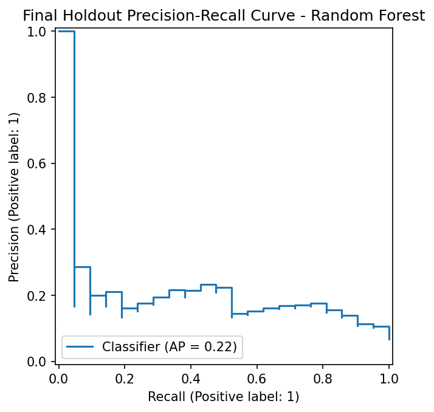
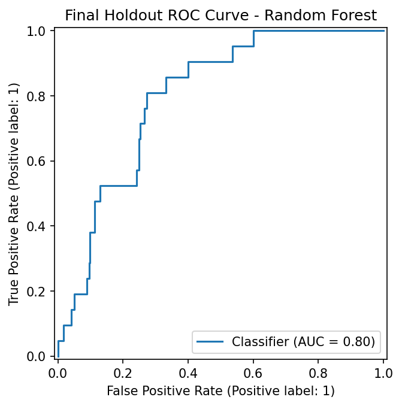
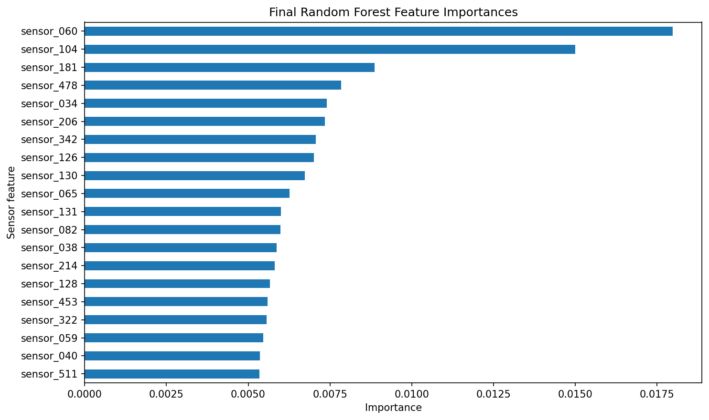

# Output Files

This folder contains generated evidence from the SECOM pass/fail project. The files are produced by the script-based workflow and are used by the root README, walkthrough, final notebook, and generated reports.

## Metrics

`outputs/metrics/` contains CSV files generated by the local workflow.

| File | Description |
|---|---|
| `validation_metrics.csv` | Validation metrics for baseline and Random Forest experiments |
| `threshold_sweep.csv` | Validation threshold sweep from 0.05 to 0.95 |
| `rf_improvement_table.csv` | Random Forest comparison table used for the portfolio story |
| `final_test_metrics.csv` | One final holdout test evaluation for the validation-selected model |
| `final_feature_importance.csv` | Top final Random Forest feature importances |

These CSV files are overwritten by the latest local script run. They are not timestamped.

## Figures

`outputs/figures/` contains final figures generated by `scripts/evaluate_final_model.py`.

### Final confusion matrix

The confusion matrix shows the screening trade-off: the model detected some fail cases but also flagged many pass cases.

### Final precision-recall curve

The PR curve is important because the fail class is rare.

### Final ROC curve

The ROC curve summarizes ranking behavior, but it should be read with the PR curve because the target is highly imbalanced.

### Final feature importance

Feature importance shows model-driven signal ranking. It does not prove physical process causes.

## Interpretation Notes

- The confusion matrix is the clearest visual for the final screening trade-off.
- The PR curve is important because the fail class is small.
- The ROC curve should not be read alone.
- Feature importance should be described as model-driven signal ranking, not physical root-cause proof.

## MLflow

Local MLflow tracking files are not stored here. `mlflow.db`, `mlruns/`, and `mlartifacts/` are ignored by Git.
